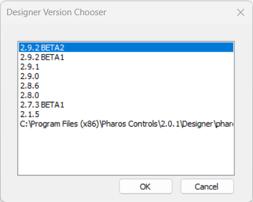

# DesignerVersionChooser

DesignerVersionChooser is a very small application which detects copies of Pharos Designer installed on a computer, and provides a simple dialog to select them.

# How to Use DesignerVersionChooser
To use the tool, download the latest installer from the [Releases](https://github.com/pharos-labs/DesignerVersionChooser/releases) page.

Then run the application - a list of detected versions will be shown. You might wish to pin the application to your taskbar or desktop for convenience.

# Building
The application is built using straight Windows API (no MFC, Qt or other toolkits) in order to keep it as absolutely minimal as possible.

You will need CMake and Visual Studio (any recent version should be fine) to build it.

To build:
- Clone the source
- From a command prompt:
  - Change to the source directory
  - Created a build directory and enter it, e.g `mkdir build`, `cd build`
- `cmake ..\` to configure
- `cmake --build . --config Release` to build a release binary
- `cpack -C release` to build the NSIS installer

# About this Pharos Labs Project
DesignerVersionChooser is designed to interact with Pharos products, but it is not official Pharos Controls software. For challenges using, integrating, compiling, or modifying items in this project, we encourage posting on the Issues page.
